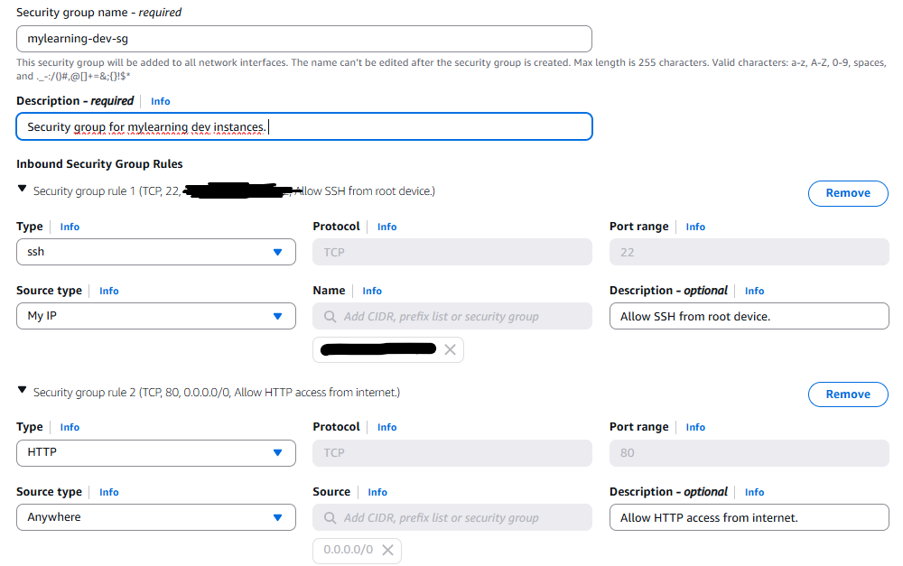
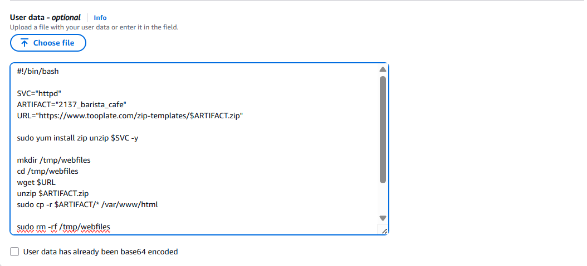

# Amazon EC2 Instance Setup
This project involves setting up a simple **AWS EC2 Instance** to host a static website, a basic task in DevOps and Cloud Computing. I will layout the steps I took and how the reader can also do the same. 

This README.md will describe the steps I took in order to reach the goal in mind. This project is a part of the roadmap.sh DevOps project series, specifically [EC2 Instance Setup](https://roadmap.sh/projects/ec2-instance).

**NOTE:** All the instances, keys, and security groups involved in this project were deleted upon the completion of this project for security purposes.

## EC2 Instance Specifications
- Instance type: `t2.micro`
- Operating system: `Amazon Linux 2023`
- Provisioning script: `setup_and_deploy.sh`

## Project Completion Steps 
### 1. Open EC2 Dashboard
Open the AWS console and go to the EC2 dashboard.


Click the orange button on the top left that says "Launch Instances", this will take us to the menu that allows us to setup the EC2 instance that we are about to launch.

### 2. Enter name and choose AMI.


The first of the setup is to give the instance a name. Following the best practices for AWS EC2 naming conventions it should follow the format `<projectName-environment-purpose-id>`. In my case, I gave it a name `mylearning-dev-web-01` meaning that this is an instance for a project called **mylearning** in a **developer environment** and serves for one of the **web servers`**.

Continuing, we then have to choose an AMI (Amazon Machine Image), which is basically a template we can use to launch operating systems to EC2 Instances. In my case, I choose the free-tier eligible Amazon Linux 2023.

### 3. Choose Instance Type
An instance type refers to the type of machine and the specifications it gets. Different types with different specifications have different purposes, and of course, different prices. I chose `t2.micro` since I was only using it for general purposes and is also free-tier eligible. 


### 4. Set up Key Pair for SSH Login
If we want to interact with the machine, we have to use SSH. In order for us to be able to do this, we must use a key pair. We can either choose an existing one, or create a new one. For demonstration purposes, I will do the latter:

 

The key type I chose is RSA, meaning that the algorithm used to create the key pair is RSA. Upon creation, the key should be downloaded to our computer, which we can use for the SSH machine login later.

### 5. Configure Network Security Group
Furthermore, we also need to state what type of traffic the instance can recieve and from where. This is done through **Security Groups**. For this, we will need to allow SSH from our local machine (to remotely login) and HTTP from the internet as we are hosting a static website. I called the security group `mylearning-dev-sg`.

This is done by choosing the following options:



### 6. Provision Machine with Script
Finally with the basic configurations done, the instance is ready to be launched. However, I added an additional step and that is to provision the instance so that it will automatically host the website once it is launched. The website I hosted was a tooplate HTML template from https://www.tooplate.com/view/2137-barista-cafe.

Below is the script I used:


**setup_and_deploy.sh:**
```bash
#!/bin/bash

SVC="httpd"
ARTIFACT="2137_barista_cafe"
URL="https://www.tooplate.com/zip-templates/$ARTIFACT.zip"

sudo yum install zip unzip $SVC -y

mkdir /tmp/webfiles
cd /tmp/webfiles
wget $URL
unzip $ARTIFACT.zip
sudo cp -r $ARTIFACT/* /var/www/html

sudo rm -rf /tmp/webfiles

sudo systemctl start $SVC
sudo systemctl enable $SVC


```

Go to advanced settings, scroll to the very bottom until you see **User data**. Copy and paste the script into the given field. 



### 7. Launch the Instance
With all the required steps done, the instance can then be launched. We can do this by pressing the "Launch Instance" button on the bottom right. This will prompt AWS to launch a new instance based on the configurations we previously gave.


The new instance, including its details such as its private and public IP can be seen in the **EC2 dashboard**. The instance will be in an "Initializing" status, which means that the instance is getting set up:


Eventually, it will reach an "2/2 Checks Passed" status, in which it is ready to be used: 


### 8. Access the website
Since we provisioned the instance to automatically host the static website, we can access the site through its public IP. Simply enter this information into your local browser:


### 9. SSH Login into the Instance
To interact with the OS of the instance we need to SSH login into the machine. As usual, we would need the `.pem` key that we created previously. Mine was `mylearning-dev-key.pem`. Locate the key and run the following commands:

```bash
chmod 400 mylearning-dev-key.pem
ssh -i mylearning-dev-key.pem ec2-user@<server_public_ip>
```

This allows us to login as `ec2-user` into the instance.

```
$ ssh -i "mylearning-dev-key.pem" ec2-user@<server's_public_ip>
Are you sure you want to continue connecting (yes/no/[fingerprint])? yes
Warning: Permanently added '<server_public_ip>' to the list of known hosts.
   ,     #_
   ~\_  ####_        Amazon Linux 2023
  ~~  \_#####\
  ~~     \###|
  ~~       \#/ ___   https://aws.amazon.com/linux/amazon-linux-2023
   ~~       V~' '->
    ~~~         /
      ~~._.   _/
         _/ _/
       _/m/'
[ec2-user@<server_public_ip> ~]$
```
Now you can whatever the hell you want with the instance!!! Have fun!!!

